# Livecoding

## Scrittura di codice dal vivo

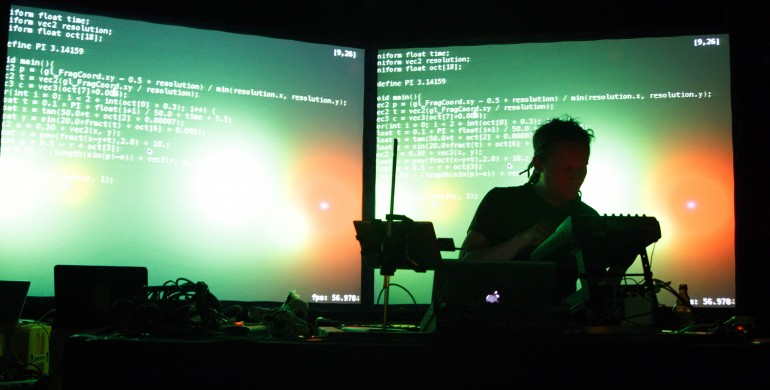
<section>
	
... ma non solo...

</section>

## Dare una definizione univoca di 'livecoding' è difficile

<section>
	
<quote><i>In live coding performance, performers create time-based works by programming them while these same works are being executed</i> C. Roberts, G. Wakefield</quote>

</section>

Il livecoding è una **pratica** compositiva e performativa in cui la scrittura di codice e la sua manipolazione vengono esposte in diverse modalità ad un audience

>Live coding is **a new direction in electronic music and video**, and is getting somewhere interesting. Live coders expose and rewire the innards of software while it generates improvised music and/or visuals. All code manipulation is projected for your pleasure.

toplap.org

Il livecoding non è un genere musicale e viene praticato in differenti contesti

> Live coding works **across musical genres**, and has been seen in concert halls, late night jazz bars, as well as algoraves. There is also a strong movement of video-based live coders, writing code to make visuals, and many environments can do both sound and video, creating **synaesthetic experiences**.

toplap.org

La pratica del livecoding non si limita al solo ambiente musicale o audiovisivo, ma abbraccia un ampio spettro di attività creative ed artistiche

>The community is diverse and seeks to engage in a wide cross-section of artistic practices including **but not limited to music**, audiovisual creation, performance, robotics, dance, scientific research and education.

ICLC 2019

**Community of practice** e **condivisione** sono elementi fondanti del livecoding. Per questo si cerca di rendere i sistemi il più possibile accessibili a tutti, a prescindere dal grado di esperienza in ambito creativo e di programmazione.

>Live coding is inclusive and accessible to all.

toplap.org

L'**errore**, il **crash** del sistema non solo sono comuni, ma fanno parte dell'estetica del livecoding.

>I like to perform in circumstances that are risky or have a high cognitive load... I'm also interested in how unintentional outputs of algorithmic processes become part of musical structure, so I don't do too much to reduce risk of error in live coding performance

Shelly Knotts

<i>I think too musch risk and you could alienate, or even hurt, your audience, and this is something which is hard to come back from. At the same time, my experience as an audience member is that one of the exciting things about live coding are those moments where you can see people really wrestling with decisions - where you see "authentic" moments of decision being taken in front of you</i>

David Ogborn

Come pratica il livecoding incoraggia lo sviluppo di un atteggiamento critico nei confronti della tecnologia e degli strumenti tecnologici.

>Live coding is primarily developed inside the **free culture movement**, and **encourages self creativity rather than cultural consumption.** Also diversity inclusion and respect has always been considered a fundamental part of the thinking around this practice in live coding communities.

ICLC 2019

#### etica hacker

L'accesso ai computer - e a tutto ciò che potrebbe insegnare qualcosa su come funziona il mondo - dev'essere assolutamente illimitato e completo. Dare sempre precedenza all'imperativo "Hands on!"  
Tutta l'informazione dev'essere libera.  
Dubitare dell'autorità. Promuovere il decentramento.  
Gli hacker dovranno essere giudicati per il loro operato, e non sulla base di falsi criteri quali ceto, età, razza, sesso o posizione sociale.  
<b>Con un computer puoi creare arte.</b>  
I computer possono cambiare la vita in meglio.  

## Quindi il live coding

* non è un genere musicale
* è una tecnica compositiva e performativa
* è utilizzato in diverse pratiche artistiche e creative
* è caratterizzato da inclusività apertura accessibilità
* si basa sui concetti di free culture e creazione di cultura piuttosto che su un suo consumo passivo

# Riferimenti

## TOPLAP

#### Temporary Organisation for the Promotion of Live Algorithm Programming

TOPLAP è un portale tramite cui accedere a risorse di vario genere relative al livecoding:
* software e librerie
* eventi in giro per il mondo
* archivio storico delle mailing list
* link ai forum
* [draft manifesto](https://toplap.org/wiki/ManifestoDraft)

## TOPLAP Italia

<a href="https://www.facebook.com/groups/1051671308353969/">Il nodo italiano</a>

## ICLC

<a href="http://127.0.0.1">ICLC2020</a>

# La performance

<section>

sicurezza e stabilità VS rischio e improvvisazione

il timore di sbagliare

preparazione e pratica

livecoding collaborativo

preview e cueing

visualizzazione del codice e visuals

</section>

### Parola d'ordine: interazione

<section>
	
Performer (idea)

	
V Software (algoritmo)

	
V Audience (ricezione e reazione all'idea formalizzata)

	
V Perfomer (mutazione del flusso creativo in base alla risposta dell'ambiente e del software)

</section>

Nel livecoding la distinzione tra programma come descrizione e programma come processo è meno marcata

### Alcuni esempi

<iframe width="1200" height="630" src="https://www.youtube.com/embed/fIuqDKzYBzc" frameborder="0" allow="accelerometer; autoplay; encrypted-media; gyroscope; picture-in-picture" allowfullscreen></iframe>

<iframe width="1200" height="630" src="https://www.youtube.com/embed/0Vh7xLZRI78" frameborder="0" allow="accelerometer; autoplay; encrypted-media; gyroscope; picture-in-picture" allowfullscreen></iframe>

<iframe width="1200" height="630" src="https://www.youtube.com/embed/JY8eNSu6HrU" frameborder="0" allow="accelerometer; autoplay; encrypted-media; gyroscope; picture-in-picture" allowfullscreen></iframe>

<iframe width="1200" height="630" src="https://www.youtube.com/embed/hoV01_P6PGw" frameborder="0" allow="accelerometer; autoplay; encrypted-media; gyroscope; picture-in-picture" allowfullscreen></iframe>

<iframe width="1200" height="630" src="https://www.youtube.com/embed/0rg5GGFaIY0" frameborder="0" allow="accelerometer; autoplay; encrypted-media; gyroscope; picture-in-picture" allowfullscreen></iframe>

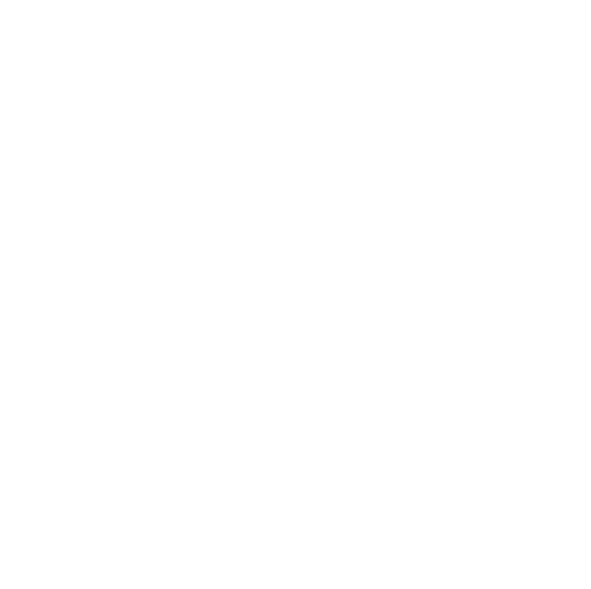

>Algorave is made from “sounds wholly or predominantly characterised by the emission of a succession of repetitive conditionals“.

>Algorave musicians don’t pretend their software is being creative, they take responsibility for the music they make, shaping it using whatever means they have

# Il codice

Come si interagisce attraverso il codice?

## strumenti

* suono procedurale
* riproduzione di campioni
* tecniche miste

## algoritmi

Formalizzazione di un processo, incorporazione (embodiment) della traduzione di un'idea creativa ad una rappresentazione formale

creazione di un proprio bagaglio di strumenti che rendono più fluida la performance

E dal punto di vista di chi assiste?

### i pattern

<section>
	
Trasformazioni matematiche (algoritmi)

	
+ Percezione del movimento e dei cambiamenti

	
+ Notazione simbolica

</section>

Il carico cognitivo di chi assiste ad una performance di livecoding non è banale. Non si è mai passivi

# I software

## SuperCollider
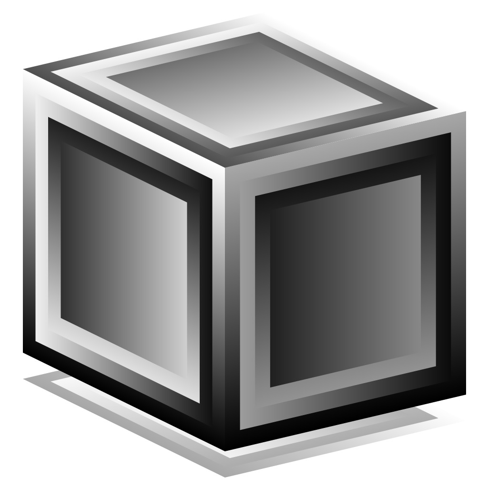

Piattaforma per la sintesi audio e la composizione algoritmica.

E' usato da musicisti, artisti e ricercatori che la vorano con il suono.

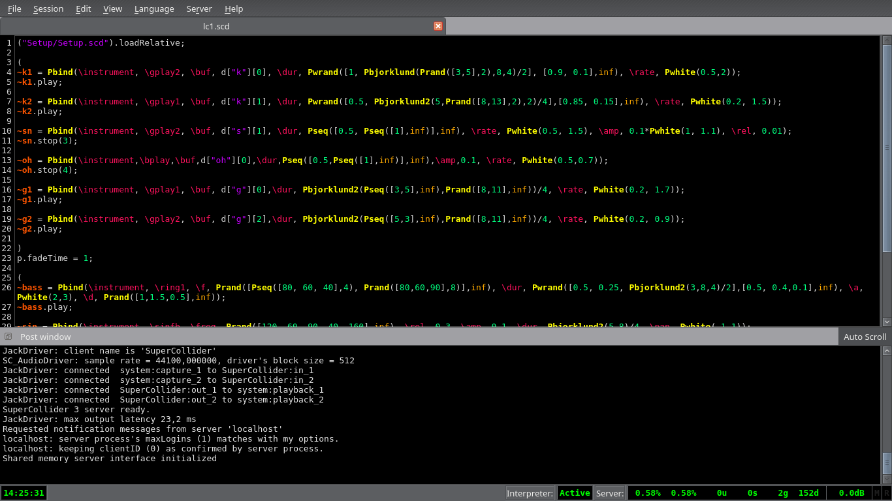

## Tidalcycles
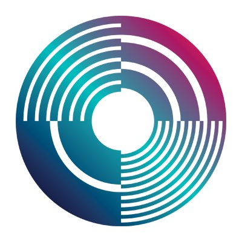

TidalCycles ('tidal') è free/open source software, che permette la creazione di pattern attraverso la scrittura di codice.

E' usato sia per il live coding che per la composizione in studio.

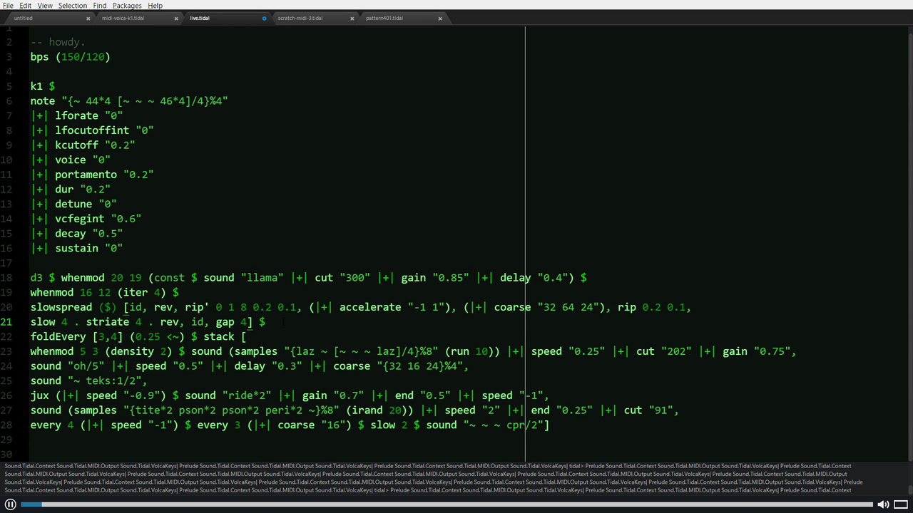

E' un'interfaccia di programmazione di SuperCollider
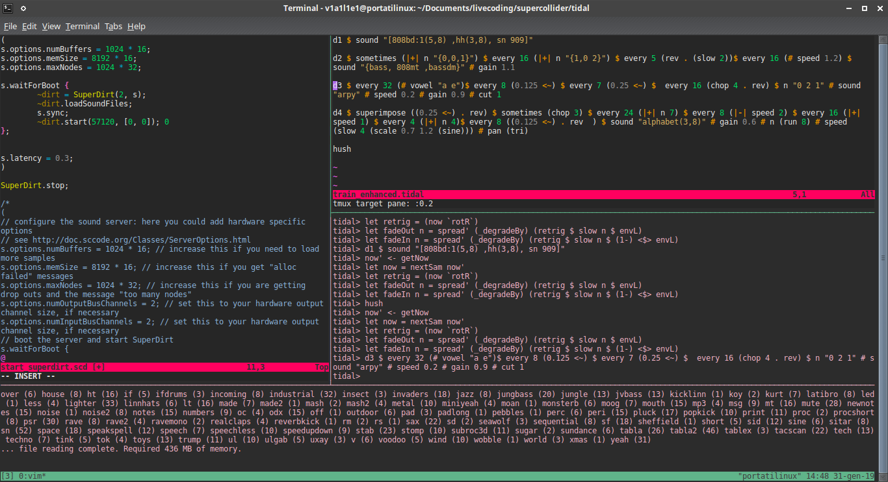

## SonicPi
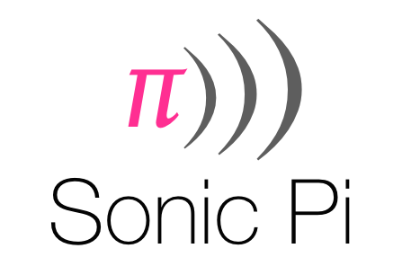

Frontend di manipolazione di campioni e synth che si basa sul server SuperCollider

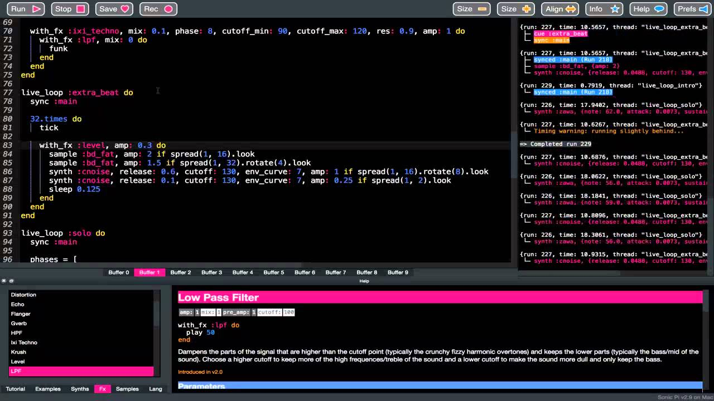

## FoxDot
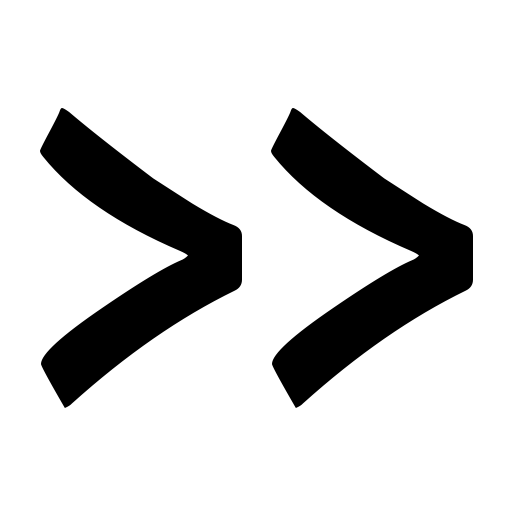

E' una libreria Python per il live coding. E' stata creata per semplificare l'approccio al live coding pre chi non è pratico di programmazione

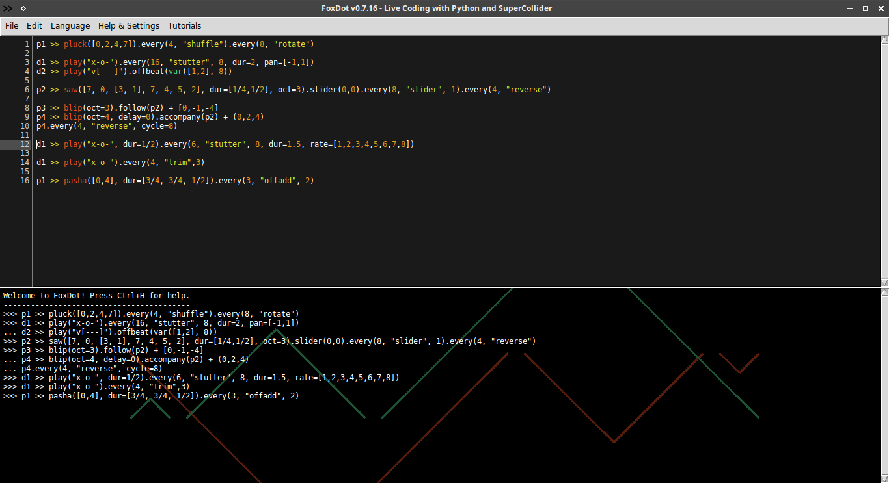

## Orca
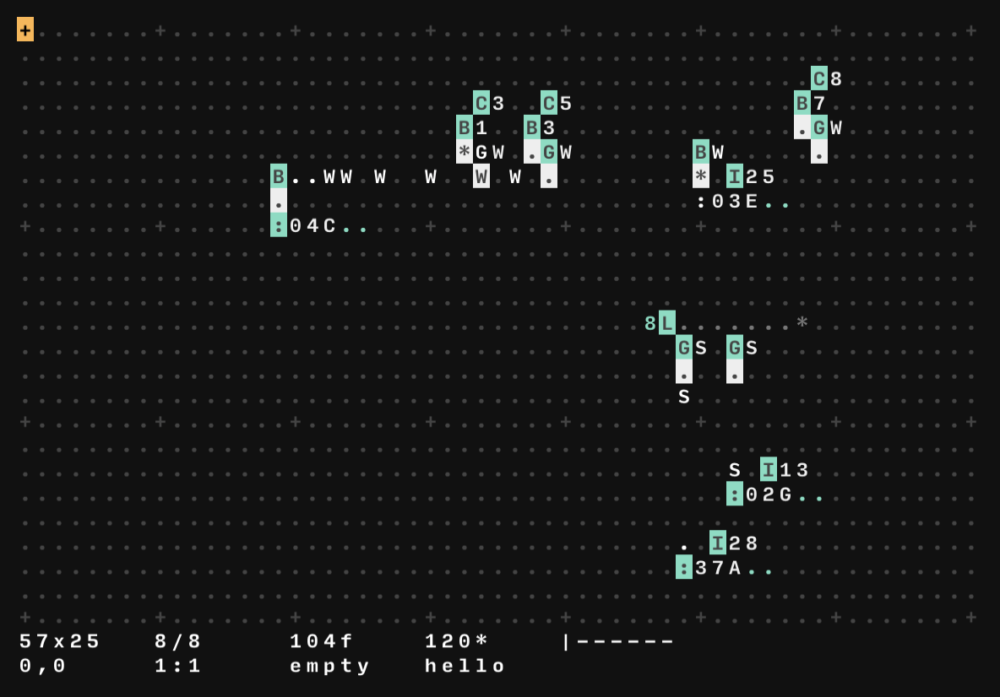

Editor basato su linguaggio esoterico tramite cui è possibile inviare CC o messaggi OSC

## Gibber
[sito](https://gibber.cc/)

Sistema completo per il livecoding basato su browser. E' possibile usare la versione online o scaricare il pacchetto e farlo girare in locale

## Hydra
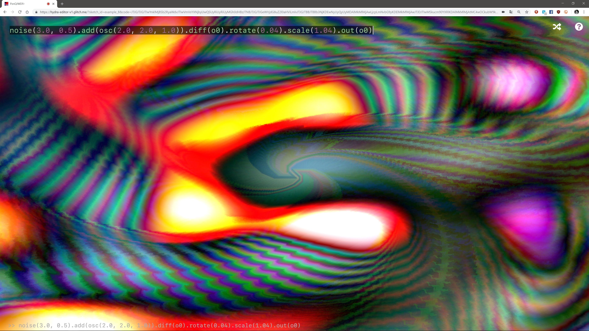

Sistema per la creazione di visuals in livecoding basato su browser.

# Live coding in SuperCollider

## Sintesi e campioni

### definizione di synth (SynthDef)

SynthDef(\k,{|out=0, amp=1| 
	var sig, env, freq, body, env_b; 
	freq = EnvGen.ar(Env([100, 60, 20],[0.001, 0.02])); 
	sig =  LFPulse.ar(freq,0, 0.5); 
	env = EnvGen.kr(Env([0.5,1,0.5,0],[0.001, 0.05, 0.2],[-4,-2,-4]), doneAction:2); 
	sig = sig\*env; 
	body = SinOsc.ar(freq,0, env); 
	body = body + WhiteNoise.ar(0.5); 
	sig = sig + body; 
	sig = LPF.ar(sig, freq*1.5, env); 
	sig = sig * 1.1; 
	sig = sig.clip2(0.8); 
	Out.ar(out, sig!2*amp); 
}).add;

### lettura e manipolazione dei campioni

SynthDef(\gplay2, 
	{ 
	    |out=0, buf=0, rate=1, d=15, trig=1, pos=0, amp=0.5, pan=0| 
	    sig,env; 
	    sig = PlayBuf.ar(2,buf,BufRateScale.ir(buf) \* rate,
	    trig,BufDur.kr(buf)\*pos\*s.sampleRate,doneAction:2); 
	    env = EnvGen.ar(Env.linen(0.0,d,0),doneAction:2); 
	    psig = sig \* env; 
	    Out.ar(out,Pan2.ar(sig*amp,pan)); 
}).add;

## I pattern

Trasformazioni matematiche su stream di valori numerici

* Pattern per la generazione di stream di valori (es. Pseq, Prand, Pwhite)
* Pattern per la generazione di stream di eventi

### Pbind: pattern in SuperCollider

**Pbind** è usato per creare pattern sonori.
Si può specificare lo strumento da usare e la durata dell'evento sonoro. Inoltre tutti i valori specificati come argomenti nella definizione dello strumento sono controllabili tramite Pbind.

SynthDef(\synth1,{ 
	arg freq=220,amp=1,out=0,feedback=0,pan=0,atk=0.1,sus=0.3,rel=0.1; 
	var sig = SinOscFB.ar(freq,feedback); 
	var env = EnvGen.ar(Env.linen(atk,sus,rel),doneAction:2); 
	Out.ar(out,Pan2.ar(sig*env*amp,pan)); 
	}).add; 

Synth(\synth1,[\feedback,0.5]);  

p=Pbind( \instrument,\synth1, \scale,Scale.chromatic(\et12), \degree,Pseq([0,3,7],inf), \dur, Pseq([1,0.5,0.5],inf), \feedback,Pwhite(0.01,0.7));
p.play;

Sentiamolo!

## ProxySpace: creazione e manipolazione dei pattern in tempo reale

* Pbind
* PDef
* Pbindef
* TDef
* NDef

# Riferimenti

<h3>Libri</h3>
<ul>
<li>Wilson, Cottle, Collins, **SuperCollider Book**, MIT Press</li>
<li>McLean, Dean, **The Oxford handbook of algorithmic music**, Oxford Press</li>
<li>Collins, Escrivàn, **The Cambridge Companion to Electronic Music**, Cambridge University Press</li>
</ul>

<h3>ebook</h3>
<ul>
<li>theseanco, **/how_co34pt_liveCode/**, <a href="https://theseanco.github.io/howto_co34pt_liveCode/">https://theseanco.github.io/howto_co34pt_liveCode/</a></li>
<li>tidal book (in lavorazione!!!)</li>
</ul>

## siti

* [TOPLAP](https://toplap.org/) 
* [Awsome livecoding](https://github.com/toplap/awesome-livecoding) --> un elenco di software e librerie dedicate al livecoding 
* [Alex McLean](https://yaxu.org/) 
* [Nick Collins](https://composerprogrammer.com/) --> un punto di riferimento per l'utilizzo di SuperCollider 
* [Renick Bell](http://www.renickbell.net/) 
* [Sean Cotterill](https://seancotterill.xyz/) --> un livecoder con la passione della condivisione 
* [Thor Magnusson](http://www.sussex.ac.uk/profiles/164902) --> creatore di ixi, ricercatore, compositore 
* [Tiempo del ruido](https://cargocollective.com/tiemposdelruido) --> Alexandra Càrdenas 
* [kindohm](http://kindohm.com/) 
* [David Ogborn]() --> creatore di Extramuros, sistema per livecoding di gruppo via network 

